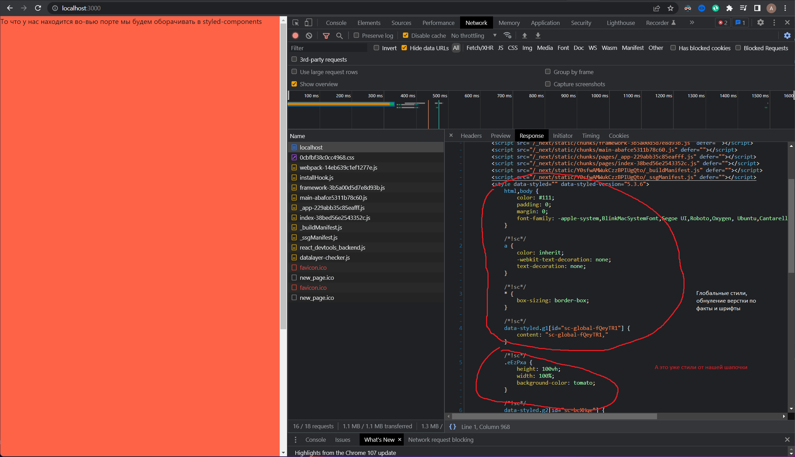
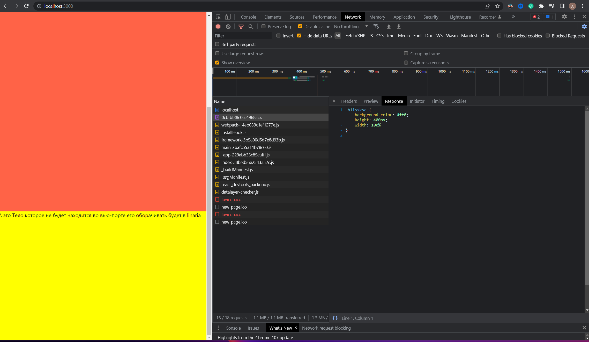
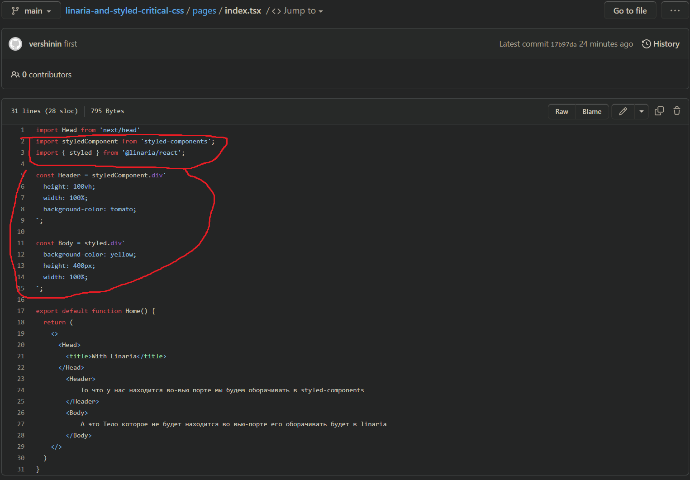

### Тут мы смотрим в шаблон и видим конечно же глобальные стили и стили от шапочки, ну оно и понятно все это так или иначе попадет в шаблон, ведь это Styled-components

### Ну а тут у нас уже Linaria видим что это файлик с хэшом

### Ну профит же сразу всех зайцев, добавляем критикал тем самым улучшаем метрики и взаимодействие пользователя с сайтом а так же общий код стайл по проекту
